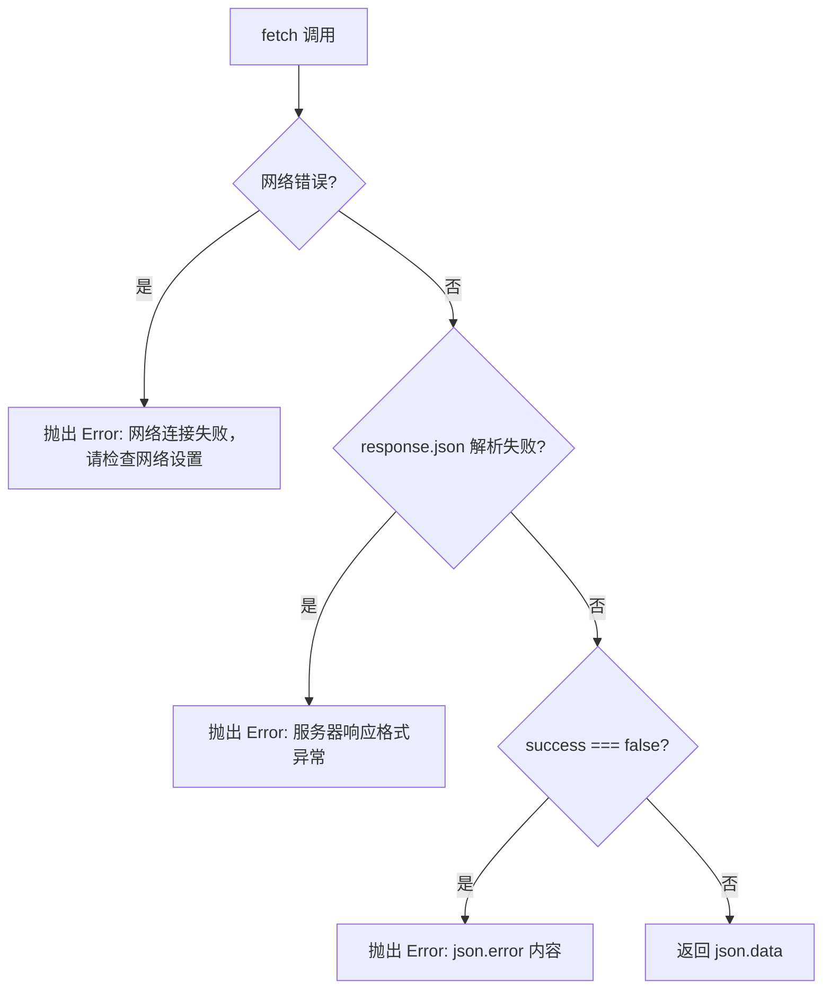

# 技术设计文档：前端 API 集成

## 概述

本设计将 MolBreeding 前端应用从本地 mock 数据驱动迁移为通过 HTTP API 与 Express 后端通信。核心变更包括：

1. 重写 `src/services/api.ts`：从 axios + NestJS 风格改为原生 fetch + 当前 Express 后端匹配
2. 改造 `src/App.tsx`：移除 mock 数据，引入 API 调用、加载状态、错误处理
3. 统一响应解析：后端返回 `{ success, data?, error? }`，前端统一提取 data 或抛出异常

设计目标是最小化改动范围，保持现有组件结构不变，仅替换数据源和操作逻辑。

## 架构

```mermaid
graph TB
    subgraph 前端 - Vite Dev Server :3000
        App[App.tsx]
        PM[ProductManagement]
        RM[ReagentManagement]
        API[src/services/api.ts]
    end

    subgraph 后端 - Express :3001
        Routes[/api/products, /api/reagents]
        Controllers[Controllers]
        Services[Services]
        DB[(SQLite)]
    end

    App --> PM
    App --> RM
    PM --> API
    RM --> API
    API -->|fetch /api/*| Routes
    Routes --> Controllers
    Controllers --> Services
    Services --> DB

    style API fill:#e1f5fe
    style App fill:#e1f5fe
```

数据流：
- Vite 开发服务器将 `/api` 前缀的请求代理到 `http://localhost:3001`
- `api.ts` 使用原生 `fetch` 发起请求，统一解析 `ApiResponse<T>` 格式
- 组件通过 `useEffect` 在挂载时获取数据，通过回调函数触发写操作
- 写操作成功后重新获取列表数据（乐观刷新策略不采用，使用服务端真实数据）

## 组件与接口

### API 服务层（`src/services/api.ts`）

完全重写现有文件，移除 axios 依赖，使用原生 fetch。

#### 核心工具函数

```typescript
// 统一响应类型（与后端 server/types.ts 中 ApiResponse 一致）
interface ApiResponse<T = any> {
  success: boolean;
  data?: T;
  error?: string;
}

// 核心请求函数
async function request<T>(url: string, options?: RequestInit): Promise<T> {
  const response = await fetch(url, {
    headers: { 'Content-Type': 'application/json' },
    ...options,
  });

  const json: ApiResponse<T> = await response.json();

  if (!json.success) {
    throw new Error(json.error || '请求失败');
  }

  return json.data as T;
}
```

#### 产品 API 方法（9 个）

| 方法 | HTTP | 路径 | 参数 | 返回 |
|------|------|------|------|------|
| `getProducts(params?)` | GET | `/api/products` | `{ category?, system? }` | `Product[]` |
| `getProduct(id)` | GET | `/api/products/:id` | - | `Product` |
| `createProduct(data)` | POST | `/api/products` | `ProductCreateDTO` | `Product` |
| `updateProduct(id, data)` | PUT | `/api/products/:id` | `ProductUpdateDTO` | `Product` |
| `publishProduct(id, data)` | POST | `/api/products/:id/publish` | `PublishDTO` | `Product` |
| `offlineProduct(id, data)` | POST | `/api/products/:id/offline` | `OfflineDTO` | `Product` |
| `syncProductConfig(id, data)` | PUT | `/api/products/:id/sync` | `SyncConfigDTO` | `Product` |
| `subPublishProduct(id, system)` | POST | `/api/products/:id/sub-publish` | `{ system }` | `Product` |
| `subOfflineProduct(id, system)` | POST | `/api/products/:id/sub-offline` | `{ system }` | `Product` |

#### 试剂 API 方法（9 个，但需求列 8 个端点 + getReagent = 9 个方法）

| 方法 | HTTP | 路径 | 参数 | 返回 |
|------|------|------|------|------|
| `getReagents(params?)` | GET | `/api/reagents` | `{ system? }` | `Reagent[]` |
| `getReagent(id)` | GET | `/api/reagents/:id` | - | `Reagent` |
| `createReagent(data)` | POST | `/api/reagents` | `ReagentCreateDTO` | `Reagent` |
| `updateReagent(id, data)` | PUT | `/api/reagents/:id` | `ReagentUpdateDTO` | `Reagent` |
| `publishReagent(id)` | POST | `/api/reagents/:id/publish` | - | `Reagent` |
| `offlineReagent(id)` | POST | `/api/reagents/:id/offline` | - | `Reagent` |
| `syncReagentConfig(id, data)` | PUT | `/api/reagents/:id/sync` | `ReagentSyncDTO` | `Reagent` |
| `subPublishReagent(id, system)` | POST | `/api/reagents/:id/sub-publish` | `{ system }` | `Reagent` |
| `subOfflineReagent(id, system)` | POST | `/api/reagents/:id/sub-offline` | `{ system }` | `Reagent` |


### App.tsx 改造方案

#### 状态管理变更

```typescript
// 移除
const [products, setProducts] = useState<Product[]>(INITIAL_PRODUCTS);
const [reagents, setReagents] = useState<Reagent[]>(INITIAL_REAGENTS);

// 替换为
const [products, setProducts] = useState<Product[]>([]);
const [reagents, setReagents] = useState<Reagent[]>([]);
const [loading, setLoading] = useState(false);
```

#### 数据获取函数

在 `App` 组件中新增两个数据获取函数，供初始加载和操作后刷新使用：

```typescript
const fetchProducts = async (params?: { category?: string; system?: string }) => {
  setLoading(true);
  try {
    const data = await productApi.getProducts(params);
    setProducts(data);
  } catch (err: any) {
    message.error(err.message || '获取产品列表失败');
  } finally {
    setLoading(false);
  }
};

const fetchReagents = async (params?: { system?: string }) => {
  setLoading(true);
  try {
    const data = await reagentApi.getReagents(params);
    setReagents(data);
  } catch (err: any) {
    message.error(err.message || '获取试剂列表失败');
  } finally {
    setLoading(false);
  }
};

useEffect(() => {
  fetchProducts();
  fetchReagents();
}, []);
```

#### 组件 Props 变更

ProductManagement 和 ReagentManagement 需要接收刷新回调，替代直接操作 state：

```typescript
// ProductManagement 新增 props
interface ProductManagementProps {
  products: Product[];
  onRefresh: () => Promise<void>;  // 替代 setProducts
  readOnly?: boolean;
  filterSystem?: 'Mainland' | 'Overseas';
}

// ReagentManagement 新增 props
interface ReagentManagementProps {
  reagents: Reagent[];
  products: Product[];
  onRefresh: () => Promise<void>;  // 替代 setReagents
  readOnly?: boolean;
  filterSystem?: 'Mainland' | 'Overseas';
}
```

#### 操作替换模式

所有写操作遵循统一模式：

```typescript
// 旧模式（本地状态操作）
const onModalSubmit = () => {
  form.validateFields().then(values => {
    setProducts(prev => [...prev, { ...values, id: `P${Date.now()}` }]);
    message.success('产品新增成功');
    setIsModalOpen(false);
  });
};

// 新模式（API 调用 + 刷新）
const onModalSubmit = async () => {
  try {
    const values = await form.validateFields();
    setSubmitting(true);
    if (editingProduct) {
      await productApi.updateProduct(editingProduct.id, values);
      message.success('产品更新成功');
    } else {
      await productApi.createProduct(values);
      message.success('产品新增成功');
    }
    setIsModalOpen(false);
    await onRefresh();
  } catch (err: any) {
    if (err.errorFields) return; // 表单验证错误，不处理
    message.error(err.message || '操作失败');
  } finally {
    setSubmitting(false);
  }
};
```

#### 加载状态展示

使用 Ant Design 的 `Spin` 组件包裹内容区域：

```typescript
<Spin spinning={loading}>
  {renderContent()}
</Spin>
```

每个子组件内部的写操作使用局部 `submitting` 状态控制按钮禁用：

```typescript
const [submitting, setSubmitting] = useState(false);

// Modal 中
<Modal confirmLoading={submitting} ...>
```

## 数据模型

### 前端类型定义

前端 `App.tsx` 中已有 `Product` 和 `Reagent` 接口定义，与后端 `server/types.ts` 基本一致。API 服务层需要复用后端的 DTO 类型：

```typescript
// 从 server/types.ts 中提取的关键 DTO 类型（在 api.ts 中重新定义，避免跨项目导入）

interface ProductCreateDTO {
  code: string;
  category: '自主研发' | '定制开发';
  productType: string;
  productTech: 'GenoBaits®' | 'GenoPlexs®';
  species: string;
  alertValue: number;
  // ... 其余可选字段
}

interface PublishDTO {
  transferInfo?: string;
  remark?: string;
  syncMainland?: boolean;
  syncOverseas?: boolean;
  mainlandAlertValue?: number;
  overseasAlertValue?: number;
}

interface OfflineDTO {
  offlineReason?: string;
  remark?: string;
}

interface SyncConfigDTO {
  syncMainland: boolean;
  syncOverseas: boolean;
  mainlandAlertValue?: number;
  overseasAlertValue?: number;
}

interface ReagentCreateDTO {
  category: string;
  name: string;
  productId: string;
  spec: string;
  warehouses: { warehouse: string; itemNo: string; kingdeeCode: string }[];
}

interface ReagentSyncDTO {
  syncMainland: boolean;
  syncOverseas: boolean;
  mainlandConfig?: { alertValue: number; warehouse: string; kingdeeCode: string };
  overseasConfig?: { alertValue: number; warehouse: string; kingdeeCode: string; localName: string };
}
```

### 后端响应格式

所有后端端点统一返回：

```typescript
// 成功
{ success: true, data: T }

// 失败
{ success: false, error: "错误描述" }
```

HTTP 状态码：
- 200: 成功（GET/PUT/POST 操作）
- 201: 创建成功（POST 创建）
- 400: 请求参数错误
- 404: 资源不存在
- 500: 服务器内部错误


## 正确性属性

*属性（Property）是在系统所有有效执行中都应成立的特征或行为——本质上是关于系统应该做什么的形式化陈述。属性是人类可读规范与机器可验证正确性保证之间的桥梁。*

### 属性 1：API 响应解析正确性

*对于任意* API 响应 JSON，如果 `success` 为 `true`，则 `request` 函数应返回 `data` 字段的值；如果 `success` 为 `false`，则 `request` 函数应抛出一个 Error，其 `message` 包含响应中的 `error` 字符串。

**验证需求：1.3, 1.4**

### 属性 2：API 路径前缀正确性

*对于任意* API 服务层导出的方法调用，传递给 `fetch` 的 URL 参数都应以 `/api/` 开头。

**验证需求：1.6**

## 错误处理

### 错误分层策略



### API 服务层错误处理

```typescript
async function request<T>(url: string, options?: RequestInit): Promise<T> {
  let response: Response;
  try {
    response = await fetch(url, {
      headers: { 'Content-Type': 'application/json' },
      ...options,
    });
  } catch {
    throw new Error('网络连接失败，请检查网络设置');
  }

  let json: ApiResponse<T>;
  try {
    json = await response.json();
  } catch {
    throw new Error('服务器响应格式异常');
  }

  if (!json.success) {
    throw new Error(json.error || '请求失败');
  }

  return json.data as T;
}
```

### 组件层错误处理

所有组件中的 API 调用统一使用 try/catch，通过 `message.error` 展示错误：

```typescript
try {
  await someApiCall();
  message.success('操作成功');
  await onRefresh();
} catch (err: any) {
  message.error(err.message || '操作失败');
}
```

特殊情况：表单验证错误（`err.errorFields` 存在）不触发 message.error，由 Ant Design Form 自行处理。

## 测试策略

### 属性测试（Property-Based Testing）

使用项目已安装的 `fast-check` 库，对 API 服务层的核心解析逻辑进行属性测试。

- 每个属性测试运行至少 100 次迭代
- 每个测试标注对应的设计属性编号
- 标签格式：`Feature: frontend-api-integration, Property N: 属性描述`

测试文件：`src/services/__tests__/api.test.ts`

#### 属性 1 测试：API 响应解析

- 使用 `fc.record` 生成随机的 `{ success: true, data: T }` 和 `{ success: false, error: string }` 响应
- Mock `globalThis.fetch` 返回这些响应
- 验证 `request` 函数的返回值/抛出异常行为

#### 属性 2 测试：API 路径前缀

- 对所有导出的 API 方法，mock `fetch` 并捕获调用参数
- 验证 URL 以 `/api/` 开头

### 单元测试（Example-Based）

测试文件：`src/services/__tests__/api.test.ts`（与属性测试同文件）

覆盖场景：
- 网络错误（fetch 抛出 TypeError）→ 抛出"网络连接失败"
- JSON 解析失败 → 抛出"服务器响应格式异常"
- 各 API 方法的 HTTP method 和路径正确性

### 集成测试

不在本次设计范围内。组件层的 API 调用集成通过手动测试验证（启动前后端联调）。

### 不适用 PBT 的部分

需求 2-11 中的验收标准主要涉及 UI 交互行为（组件挂载时调用 API、表单提交、加载状态显示、错误提示），这些是具体的 UI 场景测试，不适合属性测试。如需自动化，应使用 React Testing Library 编写 example-based 组件测试。
