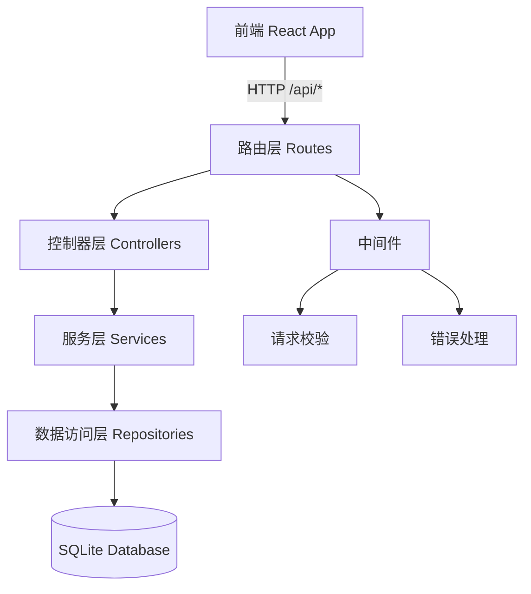
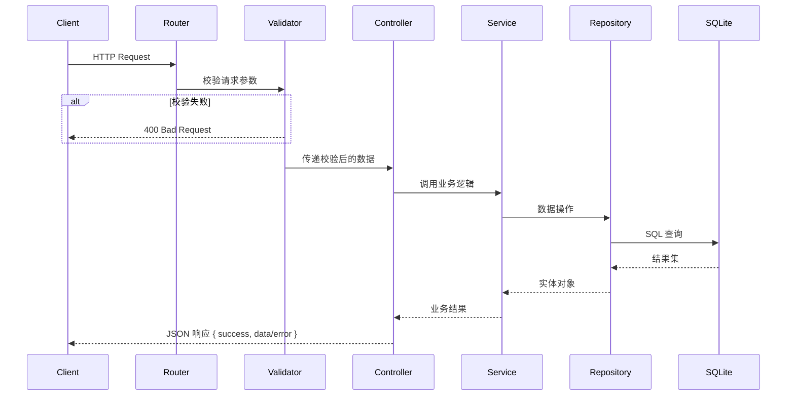
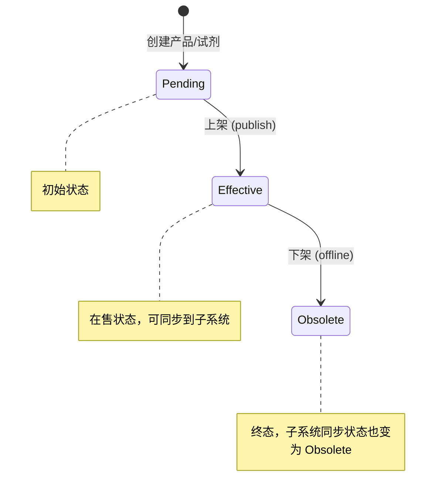
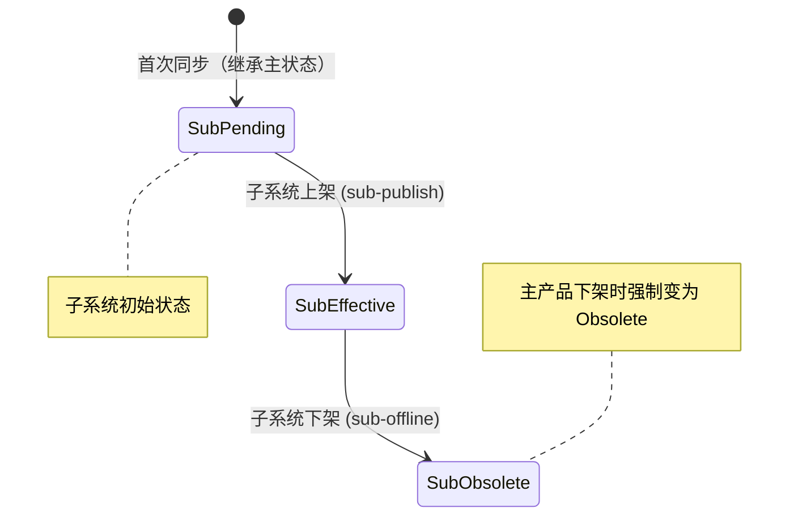

# 技术设计文档：MolBreeding 后端服务

## 概述

MolBreeding 后端服务为分子育种产品试剂管理系统提供 RESTful API。系统基于 Express + TypeScript + SQLite（better-sqlite3）构建，采用经典的四层分层架构，支持产品和试剂的 CRUD、状态流转、多子系统同步配置等核心业务。

系统服务三个业务模块：
- **产品试剂中心**：完整读写权限，管理产品和试剂的全生命周期
- **大陆 MIMS**：只读视图，展示已同步到大陆的产品/试剂
- **海外 MIMS**：只读视图，展示已同步到海外的产品/试剂（含本地化字段）

## 架构

### 分层架构



### 目录结构

```
server/
├── index.ts                  # 入口文件，启动 Express 服务
├── app.ts                    # Express 应用配置（中间件、路由挂载）
├── db.ts                     # 数据库连接与初始化
├── migrate.ts                # 数据库迁移脚本（建表 DDL）
├── routes/
│   ├── products.ts           # 产品路由
│   └── reagents.ts           # 试剂路由
├── controllers/
│   ├── productController.ts  # 产品控制器
│   └── reagentController.ts  # 试剂控制器
├── services/
│   ├── productService.ts     # 产品业务逻辑
│   ├── reagentService.ts     # 试剂业务逻辑
│   └── syncService.ts        # 同步配置逻辑
├── repositories/
│   ├── productRepo.ts        # 产品数据访问
│   ├── reagentRepo.ts        # 试剂数据访问
│   └── syncConfigRepo.ts     # 同步配置数据访问
├── middleware/
│   ├── validate.ts           # 请求校验中间件
│   └── errorHandler.ts       # 全局错误处理中间件
├── types.ts                  # 类型定义
└── errors.ts                 # 自定义错误类
data/
└── molbreeding.db            # SQLite 数据库文件
```

### 请求处理流程



## 组件与接口

### 统一响应格式

```typescript
interface ApiResponse<T = any> {
  success: boolean;
  data?: T;
  error?: string;
}
```

### 产品 API

| 方法 | 路径 | 描述 | 请求体 |
|------|------|------|--------|
| GET | `/api/products` | 产品列表（支持 `?category=` 和 `?system=` 筛选） | - |
| GET | `/api/products/:id` | 产品详情 | - |
| POST | `/api/products` | 新增产品 | ProductCreateDTO |
| PUT | `/api/products/:id` | 更新产品 | ProductUpdateDTO |
| POST | `/api/products/:id/publish` | 产品上架（Pending → Effective） | PublishDTO |
| POST | `/api/products/:id/offline` | 产品下架（Effective → Obsolete） | OfflineDTO |
| PUT | `/api/products/:id/sync` | 更新同步配置 | SyncConfigDTO |
| POST | `/api/products/:id/sub-publish` | 子系统上架 | SubSystemDTO |
| POST | `/api/products/:id/sub-offline` | 子系统下架 | SubSystemDTO |

### 试剂 API

| 方法 | 路径 | 描述 | 请求体 |
|------|------|------|--------|
| GET | `/api/reagents` | 试剂列表（支持 `?system=` 筛选） | - |
| GET | `/api/reagents/:id` | 试剂详情 | - |
| POST | `/api/reagents` | 新增试剂 | ReagentCreateDTO |
| PUT | `/api/reagents/:id` | 更新试剂 | ReagentUpdateDTO |
| POST | `/api/reagents/:id/publish` | 试剂上架 | - |
| POST | `/api/reagents/:id/offline` | 试剂下架 | - |
| PUT | `/api/reagents/:id/sync` | 更新试剂同步配置 | ReagentSyncDTO |
| POST | `/api/reagents/:id/sub-publish` | 子系统上架 | SubSystemDTO |
| POST | `/api/reagents/:id/sub-offline` | 子系统下架 | SubSystemDTO |

### 关键 DTO 定义

```typescript
// 产品创建
interface ProductCreateDTO {
  code: string;           // 必填，唯一
  category: '自主研发' | '定制开发';  // 必填
  productType: string;    // 必填
  productTech: 'GenoBaits®' | 'GenoPlexs®';  // 必填
  species: string;        // 必填
  alertValue: number;     // 必填，正整数
  version?: string;
  nameEn?: string;
  nameCn?: string;
  // ... 其余可选字段
}

// 产品上架
interface PublishDTO {
  transferInfo?: string;
  remark?: string;
  syncMainland?: boolean;
  syncOverseas?: boolean;
  mainlandAlertValue?: number;
  overseasAlertValue?: number;
}

// 产品下架
interface OfflineDTO {
  offlineReason?: string;
  remark?: string;
}

// 同步配置
interface SyncConfigDTO {
  syncMainland: boolean;
  syncOverseas: boolean;
  mainlandAlertValue?: number;
  overseasAlertValue?: number;
}

// 子系统操作
interface SubSystemDTO {
  system: 'mainland' | 'overseas';
}

// 试剂创建
interface ReagentCreateDTO {
  category: string;       // 必填
  name: string;           // 必填
  productId: string;      // 必填，关联产品须为 Effective
  spec: string;           // 必填
  warehouses: Array<{     // 必填，至少一条
    warehouse: string;
    itemNo: string;
    kingdeeCode: string;
  }>;
}

// 试剂同步配置
interface ReagentSyncDTO {
  syncMainland: boolean;
  syncOverseas: boolean;
  mainlandConfig?: {
    alertValue: number;
    warehouse: string;
    kingdeeCode: string;
  };
  overseasConfig?: {
    alertValue: number;
    warehouse: string;
    kingdeeCode: string;
    localName: string;    // 海外必填
  };
}
```

### 状态流转图



子系统状态独立于主状态管理：



## 数据模型

### products 表

```sql
CREATE TABLE IF NOT EXISTS products (
  id TEXT PRIMARY KEY,
  code TEXT NOT NULL UNIQUE,
  category TEXT NOT NULL CHECK(category IN ('自主研发', '定制开发')),
  status TEXT NOT NULL DEFAULT 'Pending' CHECK(status IN ('Pending', 'Effective', 'Obsolete')),
  version TEXT,
  nameEn TEXT,
  nameCn TEXT,
  projectCode TEXT,
  productType TEXT NOT NULL,
  productTech TEXT NOT NULL CHECK(productTech IN ('GenoBaits®', 'GenoPlexs®')),
  species TEXT NOT NULL,
  clientUnit TEXT,
  clientName TEXT,
  alertValue INTEGER NOT NULL CHECK(alertValue > 0),
  deliveryForm TEXT,
  finalReport INTEGER NOT NULL DEFAULT 0,
  coverModule TEXT,
  dataStandardGb TEXT,
  dataLowerLimitGb TEXT,
  actualDataGb TEXT,
  segmentCount TEXT,
  coreSnpCount TEXT,
  mSnpCount TEXT,
  indelCount TEXT,
  targetRegionCount TEXT,
  segmentInnerType TEXT,
  refGenome TEXT,
  annotationInfo TEXT,
  refGenomeSpecies TEXT,
  refGenomeSizeGb TEXT,
  qcParam TEXT,
  qcStandard TEXT,
  applicationDirection TEXT,
  catalog TEXT,
  configDir TEXT,
  isLocusSecret INTEGER NOT NULL DEFAULT 0,
  reagentQc TEXT,
  transferDate TEXT,
  usage TEXT,
  recommendCrossCycle TEXT,
  traitName TEXT,
  canUpgradeToNewVersion INTEGER NOT NULL DEFAULT 0,
  minEffectiveDepth TEXT,
  transgenicEvent TEXT,
  transferInfo TEXT,
  remark TEXT,
  -- 同步字段
  syncMainland INTEGER NOT NULL DEFAULT 0,
  syncOverseas INTEGER NOT NULL DEFAULT 0,
  mainlandAlertValue INTEGER,
  mainlandStatus TEXT CHECK(mainlandStatus IS NULL OR mainlandStatus IN ('Pending', 'Effective', 'Obsolete')),
  overseasAlertValue INTEGER,
  overseasStatus TEXT CHECK(overseasStatus IS NULL OR overseasStatus IN ('Pending', 'Effective', 'Obsolete')),
  createdAt TEXT NOT NULL DEFAULT (datetime('now')),
  updatedAt TEXT NOT NULL DEFAULT (datetime('now'))
);
```

### reagents 表

```sql
CREATE TABLE IF NOT EXISTS reagents (
  id TEXT PRIMARY KEY,
  category TEXT NOT NULL,
  name TEXT NOT NULL,
  productId TEXT NOT NULL REFERENCES products(id),
  spec TEXT NOT NULL,
  batchNo TEXT,
  stock INTEGER,
  expiryDate TEXT,
  status TEXT NOT NULL DEFAULT 'Pending' CHECK(status IN ('Pending', 'Effective', 'Obsolete')),
  syncMainland INTEGER NOT NULL DEFAULT 0,
  syncOverseas INTEGER NOT NULL DEFAULT 0,
  createdAt TEXT NOT NULL DEFAULT (datetime('now')),
  updatedAt TEXT NOT NULL DEFAULT (datetime('now'))
);

CREATE INDEX IF NOT EXISTS idx_reagents_productId ON reagents(productId);
```

### reagent_warehouses 表

```sql
CREATE TABLE IF NOT EXISTS reagent_warehouses (
  id TEXT PRIMARY KEY,
  reagentId TEXT NOT NULL REFERENCES reagents(id) ON DELETE CASCADE,
  warehouse TEXT NOT NULL,
  itemNo TEXT NOT NULL,
  kingdeeCode TEXT NOT NULL
);

CREATE INDEX IF NOT EXISTS idx_reagent_warehouses_reagentId ON reagent_warehouses(reagentId);
```

### reagent_sync_configs 表

```sql
CREATE TABLE IF NOT EXISTS reagent_sync_configs (
  id TEXT PRIMARY KEY,
  reagentId TEXT NOT NULL REFERENCES reagents(id) ON DELETE CASCADE,
  system TEXT NOT NULL CHECK(system IN ('mainland', 'overseas')),
  alertValue INTEGER,
  warehouse TEXT,
  kingdeeCode TEXT,
  localName TEXT,
  status TEXT NOT NULL DEFAULT 'Pending' CHECK(status IN ('Pending', 'Effective', 'Obsolete')),
  UNIQUE(reagentId, system)
);

CREATE INDEX IF NOT EXISTS idx_reagent_sync_configs_reagentId ON reagent_sync_configs(reagentId);
```


## 正确性属性（Correctness Properties）

*正确性属性是在系统所有有效执行中都应成立的特征或行为——本质上是对系统应做什么的形式化陈述。属性是人类可读规格说明与机器可验证正确性保证之间的桥梁。*

### Property 1: 产品 CRUD 往返一致性

*对于任意*有效的产品数据，创建产品后通过 GET /api/products/:id 查询，返回的产品数据应与创建时提交的数据一致（id 和时间戳除外）。同样，更新产品后查询应反映更新后的值。

**Validates: Requirements 3.4, 3.6, 3.9**

### Property 2: 试剂 CRUD 往返一致性

*对于任意*有效的试剂数据（含库房信息），创建试剂后通过 GET /api/reagents/:id 查询，返回的试剂数据应与创建时提交的数据一致，且 warehouses 数组包含所有提交的库房记录。更新试剂后（先删后插库房），查询应反映新的库房记录。

**Validates: Requirements 7.1, 7.4, 7.5, 7.8**

### Property 3: 产品 system 筛选正确性

*对于任意*产品数据集和任意 system 参数值（'mainland' 或 'overseas'），GET /api/products?system=X 返回的所有产品都应满足对应的 syncX 字段为 true，且返回的 alertValue 应等于对应子系统的 alertValue。

**Validates: Requirements 3.1, 3.2, 3.3**

### Property 4: 试剂 system 筛选正确性

*对于任意*试剂数据集和任意 system 参数值，GET /api/reagents?system=X 返回的所有试剂都应满足对应的 syncX 字段为 true，且附带对应子系统的同步配置。

**Validates: Requirements 7.2, 7.3**

### Property 5: 不存在的资源返回 404

*对于任意*不存在的 ID，GET /api/products/:id、PUT /api/products/:id、GET /api/reagents/:id、PUT /api/reagents/:id 都应返回 HTTP 404 状态码和 `{ success: false, error: "..." }` 格式的响应。

**Validates: Requirements 3.5, 3.10, 7.9**

### Property 6: 产品状态机合法转换

*对于任意*产品，状态流转仅允许 Pending → Effective（上架）和 Effective → Obsolete（下架）。对于任意 Pending 状态的产品，publish 操作后状态应为 Effective；对于任意 Effective 状态的产品，offline 操作后状态应为 Obsolete 且子系统状态也变为 Obsolete。对于任意不符合上述规则的状态转换请求，应返回 HTTP 400。

**Validates: Requirements 4.1, 4.2, 4.3, 4.4, 4.5**

### Property 7: 试剂状态机合法转换

*对于任意*试剂，状态流转仅允许 Pending → Effective 和 Effective → Obsolete。合法转换应成功更新状态，非法转换应返回 HTTP 400。

**Validates: Requirements 8.1, 8.2, 8.3**

### Property 8: 产品同步配置往返一致性

*对于任意*有效的同步配置数据，通过 PUT /api/products/:id/sync 更新后，查询该产品应反映新的 syncMainland、syncOverseas 和对应的 alertValue。首次同步到某子系统时，该子系统的 status 应等于产品主状态。

**Validates: Requirements 5.1, 5.2**

### Property 9: 试剂同步配置往返一致性

*对于任意*有效的试剂同步配置数据，通过 PUT /api/reagents/:id/sync 更新后，查询该试剂应反映新的同步配置。大陆配置应包含 alertValue、warehouse、kingdeeCode；海外配置应额外包含 localName。

**Validates: Requirements 9.1, 9.2, 9.3**

### Property 10: 产品子系统独立状态管理

*对于任意*已同步到某子系统的产品，sub-publish 操作后该子系统 status 应为 Effective，sub-offline 操作后应为 Obsolete。对于未同步到目标子系统的产品，操作应返回 HTTP 400。

**Validates: Requirements 6.1, 6.2, 6.3**

### Property 11: 试剂子系统独立状态管理

*对于任意*已同步到某子系统的试剂，sub-publish 操作后该子系统同步配置 status 应为 Effective，sub-offline 操作后应为 Obsolete。对于未同步到目标子系统的试剂，操作应返回 HTTP 400。

**Validates: Requirements 10.1, 10.2, 10.3**

### Property 12: 必填字段校验

*对于任意*缺少必填字段的产品创建请求（code、category、productType、productTech、species、alertValue 中任一缺失）或试剂创建请求（category、name、productId、spec、warehouses 中任一缺失），系统应返回 HTTP 400 和具体的字段校验错误信息。

**Validates: Requirements 3.8, 7.7**

### Property 13: 枚举字段校验

*对于任意*不在允许枚举范围内的 category、status、productTech 字段值，系统应返回 HTTP 400。alertValue 必须为正整数，非正整数值应被拒绝。

**Validates: Requirements 11.3, 11.4, 11.5, 11.6**

### Property 14: 产品编号唯一性约束

*对于任意*已存在的产品编号，使用相同 code 创建新产品应返回 HTTP 409 冲突错误。

**Validates: Requirements 3.7**

### Property 15: 试剂仅能关联已生效产品

*对于任意*状态不是 Effective 的产品，以该产品 ID 创建试剂应返回 HTTP 400。

**Validates: Requirements 7.6**

### Property 16: 同步配置必填字段校验

*对于任意*开启了某子系统但未提供该子系统必要参数的同步请求（产品：缺少 alertValue；试剂海外：缺少 localName），系统应返回 HTTP 400。

**Validates: Requirements 5.3, 9.4**

### Property 17: 统一响应格式

*对于任意* API 请求（无论成功或失败），响应体都应符合 `{ success: boolean, data?: T, error?: string }` 格式。成功时 success 为 true 且包含 data，失败时 success 为 false 且包含 error。

**Validates: Requirements 1.5**

### Property 18: 未知路由返回 404

*对于任意*不存在的路由路径，系统应返回 HTTP 404 状态码和描述性错误信息。

**Validates: Requirements 1.6**

## 错误处理

### 错误分类与 HTTP 状态码

| 错误类型 | HTTP 状态码 | 触发条件 |
|----------|------------|----------|
| 校验错误 | 400 | 必填字段缺失、类型错误、枚举值非法、JSON 解析失败 |
| 状态流转错误 | 400 | 不合法的状态转换（如 Pending 直接下架） |
| 业务规则错误 | 400 | 试剂关联非 Effective 产品、未同步子系统操作 |
| 资源不存在 | 404 | 产品/试剂 ID 不存在、路由不存在 |
| 唯一约束冲突 | 409 | 产品编号重复 |
| 服务器内部错误 | 500 | 未捕获异常（不暴露内部细节） |

### 自定义错误类

```typescript
class AppError extends Error {
  constructor(
    public statusCode: number,
    public message: string
  ) {
    super(message);
  }
}

class ValidationError extends AppError {
  constructor(message: string) { super(400, message); }
}

class NotFoundError extends AppError {
  constructor(resource: string) { super(404, `${resource} not found`); }
}

class ConflictError extends AppError {
  constructor(message: string) { super(409, message); }
}
```

### 全局错误处理中间件

```typescript
function errorHandler(err: Error, req: Request, res: Response, next: NextFunction) {
  if (err instanceof AppError) {
    return res.status(err.statusCode).json({ success: false, error: err.message });
  }
  console.error('Unhandled error:', err);
  res.status(500).json({ success: false, error: 'Internal server error' });
}
```

## 测试策略

### 测试框架

- 单元测试与属性测试：**Vitest** + **fast-check**
- HTTP 集成测试：**supertest**

### 属性测试（Property-Based Testing）

本项目的核心业务逻辑（CRUD 往返、状态机转换、筛选逻辑、校验规则）非常适合属性测试。每个属性测试：

- 使用 fast-check 生成随机输入
- 最少运行 100 次迭代
- 通过注释标注对应的设计文档属性编号
- 标签格式：**Feature: molbreeding-backend, Property {number}: {property_text}**

### 单元测试

单元测试聚焦于：
- 具体的边界案例（空字符串、极大值、特殊字符）
- 集成点验证（数据库迁移、中间件链路）
- 错误条件的具体场景

### 测试目录结构

```
server/
└── __tests__/
    ├── product.test.ts          # 产品 CRUD + 状态流转
    ├── reagent.test.ts          # 试剂 CRUD + 状态流转
    ├── sync.test.ts             # 同步配置
    ├── validation.test.ts       # 校验规则
    └── properties/
        ├── product.prop.test.ts # 产品属性测试
        ├── reagent.prop.test.ts # 试剂属性测试
        ├── sync.prop.test.ts    # 同步属性测试
        └── validation.prop.test.ts # 校验属性测试
```

### 测试覆盖矩阵

| 属性编号 | 测试类型 | 测试文件 |
|---------|---------|---------|
| Property 1-2 | 属性测试 | product.prop.test.ts / reagent.prop.test.ts |
| Property 3-4 | 属性测试 | product.prop.test.ts / reagent.prop.test.ts |
| Property 5 | 属性测试 | product.prop.test.ts / reagent.prop.test.ts |
| Property 6-7 | 属性测试 | product.prop.test.ts / reagent.prop.test.ts |
| Property 8-9 | 属性测试 | sync.prop.test.ts |
| Property 10-11 | 属性测试 | sync.prop.test.ts |
| Property 12-16 | 属性测试 | validation.prop.test.ts |
| Property 17-18 | 属性测试 | validation.prop.test.ts |
| SMOKE (需求 2, 12) | 单元测试 | 集成测试中验证 |
